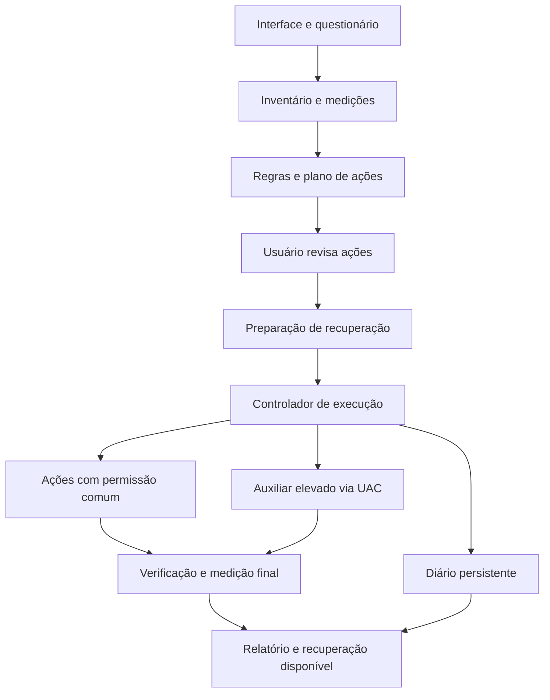

# ZEUS — relatório de viabilidade e plano do aplicativo

Pesquisa documental: 7 de outubro de 2026. Objetivo: criar um aplicativo Windows que diagnostique o computador, proponha melhorias adequadas ao uso e execute manutenção real, com histórico e recuperação.

## 1. Recomendação principal

O aplicativo é viável. A melhor proposta é **diagnosticar → perguntar → preparar a recuperação → aplicar um plano → medir o resultado**. Isso permite atender computadores fracos e potentes sem aplicar a mesma receita a todos.

O ZEUS pode reduzir programas desnecessários em segundo plano, recuperar espaço, corrigir corrupção do Windows, organizar atualizações, verificar segurança e ajustar a experiência visual. Não pode transformar uma CPU antiga em uma nova, aumentar fisicamente a RAM, recuperar desgaste de um SSD ou resolver refrigeração defeituosa por comandos. Quando o problema for físico, o relatório deve identificá-lo e orientar manutenção ou upgrade compatível.

“Otimização geral” será uma sequência individualizada. “Otimizar para jogos” e “otimizar para trabalho” podem produzir escolhas diferentes. O sucesso deve aparecer em medidas compreensíveis, como tempo para abrir um programa, fluidez durante o trabalho, tempo de inicialização e espaço recuperado. Não recomendar uma promessa universal de ganho em porcentagem.

**Escopo inicial recomendado:** Windows 11 em versões suportadas, computadores pessoais x64, interface em português e processamento local. Compatibilidade ARM64, Windows 10 conforme edição/cobertura de suporte, máquinas corporativas e servidores exige avaliação própria. O programa deve detectar versão, arquitetura e políticas antes de habilitar ações.

## 2. Módulos do produto

| Módulo | O que entrega | Como executar de forma adequada |
| --- | --- | --- |
| Painel e diagnóstico | Componentes, problemas observados, tarefas em execução e limitações | Coletar inventário e métricas; distinguir informação medida de estimativa |
| Otimização geral | Plano baseado no uso e na máquina | Selecionar ações compatíveis, mostrar efeitos e medir antes/depois |
| Limpeza e armazenamento | Espaço recuperável, disco e volumes, manutenção adequada à mídia | Prever exclusões; preservar arquivos pessoais; respeitar ferramentas Windows |
| Inicialização e segundo plano | Aplicativos que iniciam com o Windows e seu impacto | Usuário escolhe o que precisa; guardar configuração anterior |
| Windows e reparos | Integridade de arquivos/sistema, erros relevantes, reinício pendente | Diagnosticar primeiro; executar reparo indicado; conferir resultado |
| Drivers e atualizações | Dispositivos com problemas, candidatos compatíveis e origem dos pacotes | Windows Update/OEM; atualização individual, assinada e rastreável |
| Segurança | Estado da proteção e verificações do antivírus existente | Defender quando ativo; integração específica se houver outro produto |
| Energia e bateria | Perfil conforme desempenho, autonomia e temperatura | Respeitar notebook, carregador, bateria e modos suportados |
| Rede | Diagnóstico de conectividade, adaptador e problemas identificados | Reparos pontuais; sem prometer aumentar a velocidade contratada |
| Aparência | Temas do ZEUS e preferências visuais do Windows | Separar visual do app de personalização do desktop |
| Histórico e recuperação | Alterações, resultados, reinícios e opções de desfazer | Diário persistente e reversão por ação quando disponível |

Atualização de aplicativos pode ser uma expansão: apresentar candidatos e compatibilidade, preservando configurações e licenças. Não incluir instalações em massa e silenciosas dentro do botão de otimização.

## 3. Hardware: o que descobrir e o que realmente melhorar

| Componente | Informações e sinais úteis | Possíveis ações | Limite |
| --- | --- | --- | --- |
| CPU | Modelo, núcleos, uso por núcleo, processos, clocks e temperatura quando disponíveis | Reduzir carga desnecessária; corrigir perfil de energia inadequado; apontar limitação térmica | Não cria núcleos, capacidade de processamento ou refrigeração |
| GPU | Modelo, driver, memória dedicada, uso, tempo de quadro, sensores suportados | Driver compatível; orientar configurações gráficas; verificar uso da GPU apropriada quando suportado | Não aumenta VRAM física; APIs e métricas variam por fabricante |
| RAM | Capacidade, módulos, memória disponível/comprometida e paginação | Reduzir processos dispensáveis; identificar aplicação excessiva; orientar upgrade | Esvaziar RAM não aumenta capacidade; cache ocupado pode ser útil |
| SSD/NVMe | Espaço, latência, erros, desgaste/temperatura quando fornecidos | Limpeza seletiva e manutenção Windows/TRIM quando aplicável | Não repara desgaste ou garante integridade futura |
| HDD | Latência, atividade, espaço e sinais de falha | Limpeza e análise/desfragmentação quando indicada | Desfragmentação não transforma HDD em SSD |
| Placa-mãe/BIOS | Fabricante/modelo, versão de BIOS e recursos expostos | Verificar compatibilidade e orientar suporte OEM | Não mede automaticamente qualidade de VRM ou permite flash universal |
| Refrigeração | Temperaturas, clocks sob carga, eventos e sensores disponíveis | Identificar possível redução térmica de desempenho; recomendar manutenção física | Nem todo computador expõe sensores confiáveis |
| Fonte | Telemetria de equipamentos que explicitamente ofereçam suporte | Mostrar dados disponíveis e solicitar identificação manual quando necessária | Uma fonte comum não informa universalmente modelo, potência nominal ou consumo total ao Windows |
| Notebook | Bateria, alimentação, sensores e perfis disponíveis | Equilibrar autonomia e resposta; reduzir efeitos/carga no modo bateria | Não recupera desgaste químico da bateria |
| Rede/periféricos | Estado dos adaptadores, erros de dispositivos e conectividade | Diagnóstico e driver adequado | Não corrige interferência, cabo defeituoso ou limitações do provedor por “boost” |

### Fontes de dados e cuidados técnicos

- **CIM/WMI:** inventário de CPU, RAM, placa-mãe e dispositivos. Ex.: `Win32_Processor`, `Win32_PhysicalMemory` e `Win32_BaseBoard`. Preferir APIs/CIM atuais; exemplos antigos em VBScript não são a arquitetura proposta.
- **Performance Counters/ETW:** monitoramento de CPU, memória e disco. Coletar durante a tarefa que o usuário considera lenta. Uso total baixo de CPU pode esconder um único núcleo saturado.
- **DXGI:** inventário de adaptadores e memória gráfica. `Win32_VideoController.AdapterRAM` é um inteiro de 32 bits; não usar como única leitura de VRAM moderna. Memória compartilhável não equivale à memória dedicada. `QueryVideoMemoryInfo` informa uso/orçamento do processo consultante, não uso total de todos os programas.
- **NVML/ADLX:** integrar telemetria NVIDIA/AMD apenas para métricas e modelos suportados. Consultar disponibilidade antes de usar uma leitura. Consumo da GPU não é consumo total do computador.
- **PresentMon:** opção avançada para medir tempo de quadro e desempenho gráfico. Há limitações documentadas, inclusive para algumas métricas com agendamento de GPU acelerado por hardware.
- **Windows Storage:** correlacionar disco físico com seus volumes. `Get-StorageReliabilityCounter` pode fornecer temperatura, erros, desgaste e horas; RAID, USB e controladores podem não expor dados.
- **LibreHardwareMonitor:** biblioteca candidata para sensores adicionais. Sua documentação declara suporte a vários componentes e necessidade de administrador para alguns sensores. Exige auditoria de dependências, compatibilidade de acesso ao hardware e cumprimento da MPL 2.0 e avisos de terceiros. Não incluir um driver de baixo nível apenas para completar gráficos.

Apresentar **“indisponível”** quando não houver sensor. Valor zero inventado, “saúde 100%” sem dados e “gargalo 37%” sem metodologia prejudicam a confiabilidade do produto. Limites de temperatura dependem do modelo; não criar um limite universal para todas as CPUs e GPUs.

### Exemplo: PC fraco com pouca RAM e HDD

Primeiro observar a tarefa real. Se há pressão de memória, paginação e vários programas iniciando automaticamente, revisar esses programas e preferências visuais pode ajudar. Se o HDD continua sendo a limitação, a recomendação principal pode ser trocar por SSD compatível. Se CPU/GPU permanecem no limite mesmo com o sistema organizado, é preciso ajustar a carga ou considerar hardware. O relatório deve explicar isso sem vender uma limpeza como solução física.

## 4. Fluxo da otimização geral

1. **Diagnóstico sem elevação obrigatória.** Identificar Windows, componentes, espaço, processos, estado de proteção, bateria e reinício pendente. Informações privilegiadas podem ser coletadas por um auxiliar quando necessário.
2. **Questionário curto.** Trabalho/estudo, jogos, edição ou uso misto; prioridade entre desempenho, autonomia e silêncio; programas essenciais; uso de impressão, Bluetooth, câmera, OneDrive, busca e virtualização. Perguntas sobre um recurso só aparecem se houver ação que o afete.
3. **Medição inicial.** Coletar uma janela de uso representativa e definir o que comparar. Se não houver benchmark adequado, informar que a conclusão é limitada.
4. **Plano revisável.** Mostrar ação, motivo, impacto esperado, possível perda de função, necessidade de administrador/reinício e possibilidade de desfazer. A previsão de ganho é uma hipótese a verificar.
5. **Preparação de recuperação.** Confirmar Proteção do Sistema e ponto de restauração aplicável; guardar estados originais e backups específicos das ações. Não iniciar mudanças que dependam de uma proteção que falhou.
6. **Execução por dependência.** Solicitar UAC quando necessário; respeitar ações incompatíveis e reinícios. Não rodar simultaneamente atualizações, instalação de drivers e reparos concorrentes sobre os mesmos componentes.
7. **Verificação por ação.** Ler resultado, estado final e necessidade de reinício. “Processo terminou” não equivale a “problema corrigido”.
8. **Comparação final.** Repetir a tarefa em condições semelhantes e registrar melhora, ausência de mudança ou piora. Não atribuir toda variação ao ZEUS.
9. **Histórico e recuperação.** Oferecer desfazer ações reversíveis e instruções específicas para as demais. Retomar a sessão após reinício sem repetir alterações já concluídas.

O perfil recomendado deve começar com medidas conservadoras e compatíveis. Um perfil avançado pode expor mais escolhas, mas não justifica aplicar ajustes sem diagnóstico.

## 5. Ponto de restauração, administrador e recuperação

A ideia de criar proteção antes de alterar o Windows é adequada, mas o ponto de restauração cobre somente parte da recuperação. A documentação Microsoft afirma que ele **não restaura dados e documentos pessoais**. Portanto, não recupera automaticamente arquivos apagados por uma limpeza. Pontos antigos também podem ser descartados conforme o espaço disponível.

`Checkpoint-Computer`, do Windows PowerShell 5.1, é documentado para Windows cliente e limita a criação a uma vez por 24 horas. O comando não devolve um objeto de ponto criado. O aplicativo deve confirmar o registro e sua identificação/data; não declarar sucesso porque a execução terminou. Um ponto recente existente não garante que represente o estado imediatamente anterior à operação atual.

O desenho deve combinar:

- Ponto de restauração confirmado para mudanças compatíveis com esse mecanismo.
- Estado anterior de cada preferência, entrada de inicialização ou configuração alterada.
- Exportação de pacotes de drivers quando aplicável e caminho de recuperação testado.
- Backup ou quarentena própria dos itens cuja exclusão o produto prometa desfazer.
- Diário em disco, incluindo ações concluídas, falhas e reinícios pendentes.

Se a proteção necessária não puder ser preparada, manter diagnóstico disponível e suspender as mudanças afetadas. Não alterar políticas/limites de restauração silenciosamente para fazer o botão parecer funcional.

A interface principal pode rodar como usuário comum. Um **auxiliar administrativo sob demanda** pede UAC para tarefas que realmente exigem elevação. Isso atende à necessidade de executar reparos como administrador sem manter todas as telas e integrações com privilégios elevados permanentemente.

Atualizações, exclusões e firmware têm recuperação diferente. “Desfazer tudo” só deve aparecer se realmente existir cobertura para todas as ações da sessão.

## 6. Windows, limpeza, drivers e antivírus

### Limpeza

Analisar arquivos temporários e categorias conhecidas; apresentar uma prévia, quantidade, localização e exclusões. Evitar pastas pessoais por padrão. Downloads, documentos, saves, cookies, senhas, perfis e lixeira exigem escolhas explícitas conforme o tipo de dado.

Arquivos em uso devem ser ignorados ou tratados pela ferramenta oficial. Limpeza não deve atravessar junctions/links e sair do escopo permitido. Caches úteis não precisam ser apagados em toda execução: reconstruí-los pode deixar a próxima abertura mais lenta. Limpeza de disco deve informar principalmente **espaço recuperado**, não automaticamente “PC mais rápido”.

Para armazenamento, analisar antes de executar manutenção. `Optimize-Volume` documenta operação padrão por tipo: HDD com análise/desfragmentação; SSD com suporte a TRIM com ReTrim; SSD sem suporte TRIM sem operação no padrão descrito. Respeitar o agendamento do Windows e as particularidades do volume. Não forçar desfragmentação tradicional em todo SSD.

### Inicialização e funções do Windows

Listar programas que iniciam automaticamente e explicar o que cada mudança afeta. Um aplicativo que o usuário não usa pode ser dispensável; um serviço do sistema não é “inútil” só porque consome recursos.

Busca, sincronização, Xbox, Bluetooth, impressão e virtualização dependem do uso. Preferir configuração suportada ou desinstalação oferecida pelo próprio produto. Preservar recursos essenciais, políticas corporativas, acessibilidade, componentes de atualização e proteção. Não aplicar uma lista genérica de serviços desativados a todas as máquinas.

### Reparos do Windows

Os comandos abaixo são mecanismos documentados, **não um script para executar tudo em sequência em qualquer PC**:

| Mecanismo | Uso adequado | Interpretação |
| --- | --- | --- |
| `sfc /verifyonly` | Verificar arquivos protegidos sem reparar | Diagnóstico; não prova desempenho nem saúde física |
| `sfc /scannow` | Verificar e reparar arquivos protegidos | Exige elevação; conferir mensagem/log e resultado |
| `Repair-WindowsImage -Online -ScanHealth` | Usar o módulo DISM para investigar corrupção da imagem Windows | Pode levar tempo; não executar como limpeza rotineira |
| `Repair-WindowsImage -Online -RestoreHealth` | Usar o módulo DISM para reparar a imagem quando indicado | Pode precisar de Windows Update ou fonte compatível; repetir SFC quando pertinente |
| `chkdsk C: /scan` | Análise online em volume NTFS | Pode incluir reparos online; não rotular como operação puramente de leitura |
| `chkdsk C: /f` | Correção de erros de sistema de arquivos diagnosticados | Pode precisar bloquear o volume ou reiniciar |
| `chkdsk C: /r` | Investigação/recuperação de setores quando indicada | Inclui `/f`; operação extensa, não rotina em cada otimização |

Ler eventos e logs serve para correlacionar sintomas. Um evento isolado não prova a causa. Reparar só o problema identificado; “atualizar bugs” significa aplicar correções disponíveis e compatíveis, não reescrever automaticamente o Windows.

Os cmdlets dependem dos módulos Windows instalados. Detectar a disponibilidade e usar o host compatível, inclusive Windows PowerShell 5.1 onde necessário; não presumir que a presença de PowerShell 7 disponibiliza automaticamente todos esses mecanismos.

### Drivers e atualizações

Prioridade: **Windows Update → fabricante do computador/placa-mãe → fabricante do componente quando compatível**. Em notebooks, o pacote OEM pode incluir adaptações importantes. Drivers opcionais não devem ser instalados apenas porque aparecem disponíveis.

Identificar dispositivo, IDs de hardware, versão/build do Windows e origem do pacote. Verificar assinatura e compatibilidade; respeitar classificação do Windows, reinício e resultado. O melhor candidato não é sempre o arquivo com número maior.

`PnPUtil` permite enumerar dispositivos/pacotes, exportar drivers e instalar pacotes INF fornecidos. Não é um catálogo que busca todos os drivers na internet. `/add-driver ... /install` não força um driver com classificação inferior. A exportação ajuda, mas não garante rollback perfeito de todo instalador/OEM.

BIOS, firmware, overclock e undervolt não entram no botão geral. Podem existir posteriormente como orientações específicas por fabricante, com pré-requisitos e recuperação próprios. Ponto de restauração não desfaz um flash de firmware.

Para Windows Update, o MVP deve priorizar diagnóstico e encaminhamento à experiência nativa. A API Windows Update Agent permite consultar/baixar/instalar atualizações, mas a própria documentação alerta para coordenação com o Update Orchestrator e diferenças de histórico/progresso em Configurações. Automação ampla exige um módulo próprio, com políticas, acompanhamento e reinício; não é simplesmente executar um comando genérico.

### Antivírus existente

O ZEUS pode ser um painel de manutenção de segurança. Não precisa criar um novo motor antivírus no MVP.

Com Microsoft Defender ativo, mecanismos documentados incluem `Get-MpComputerStatus`, `Update-MpSignature`, `Start-MpScan` e, para situações indicadas, `Start-MpWDOScan`. Oferecer verificação rápida, completa e offline conforme necessidade; a última envolve reinicialização. Uma verificação completa pode demorar e disputar recursos com outras tarefas.

Detectar o produto ativo e seu estado. Com antivírus de terceiros, utilizar integração oficial ou encaminhar para a interface do produto; não assumir que os comandos Defender controlarão outro antivírus. Respeitar modo passivo, políticas e proteção contra adulteração. Não desativar segurança para alegar ganho de desempenho.

## 7. Personalização: mínimo, completo e inspiração macOS

Há duas funcionalidades possíveis:

**Temas do próprio ZEUS:** plenamente viáveis. Minimal com poucos gráficos e animações; Completo com informações avançadas; tema original inspirado no macOS, com composição, cores e navegação próprias. Respeitar contraste elevado, movimento reduzido, teclado e leitores de tela.

**Aparência do Windows:** começar com opções suportadas de tema, cores, papel de parede, efeitos e preferências disponíveis na versão detectada. Mostrar prévia e guardar configurações anteriores. Isso não transforma Windows em macOS nem garante ganho de desempenho em outras aplicações. O primeiro fluxo de papel de parede limita-se a uma imagem estática compartilhada por todos os monitores; slideshows, papéis diferentes por monitor e a tela de bloqueio ficam fora desta ação.

Dock, widgets permanentes e substituição do Explorer aumentam o escopo: processos adicionais, manutenção, compatibilidade com updates, recuperação e licenças. Recomendo tratar como expansão independente. Não copiar ativos e marcas da Apple para a distribuição.

No modo econômico, reduzir animações e frequência de atualização dos gráficos. A Microsoft documenta que Acrylic pode exigir GPU e aumentar consumo de bateria; Mica foi desenhado para eficiência e tem fallbacks. Efeitos bonitos precisam ser medidos em hardware fraco, não apenas em uma máquina de desenvolvimento potente.

## 8. Arquitetura de implementação

**Escolha inicial sugerida: C# + versão LTS suportada do .NET + WPF.** São adequados para APIs Windows, XAML, acessibilidade e um MVP nativo. Essa é uma recomendação de engenharia, não uma demonstração de que WPF terá menor consumo em todos os cenários.

WinUI 3 é uma alternativa para uma interface Fluent moderna. Tauri é viável para equipe com experiência em frontend/Rust, mas utiliza WebView2 no Windows; instalador pequeno não prova uso menor de RAM. Fazer um protótipo comparativo antes de fixar uma meta rígida de recursos.

Componentes recomendados:

1. **Coletores de diagnóstico**, com adaptações por fabricante e valores ausentes tratados corretamente.
2. **Motor de regras**, sem depender de internet para decidir ações básicas.
3. **Catálogo de ações tipadas**, cada uma declarando compatibilidade, pré-requisitos, elevação, reinício, verificação e reversão.
4. **Controlador de execução**, que ordena dependências, limita concorrência e persiste progresso.
5. **Auxiliar administrativo**, assinado e iniciado sob demanda.
6. **Histórico/estado local**, por exemplo SQLite e arquivos de sessão protegidos por ACL.
7. **Distribuição e atualização**, com componentes assinados e origem verificável.

O canal de comunicação com o auxiliar deve aceitar operações implementadas, como `CreateRestorePoint` ou `RunDefenderScan`, e validar parâmetros. Não expor “execute este texto como administrador”. Para named pipes, definir DACL explícita e verificar usuário/sessão; a ACL padrão documentada permite leitura a grupos amplos, incluindo Everyone e anônimo.

O usuário pode interromper o plano entre ações. Cancelar uma operação em andamento depende do suporte da ferramenta nativa; o produto não deve matar processos de manutenção indiscriminadamente. Exibir progresso real quando disponível e indicar explicitamente quando uma etapa não fornece percentual.

Cada ação pode ter o seguinte contrato lógico:

`ID → versões suportadas → diagnóstico → pré-requisitos → estado anterior → execução → verificação → reversão → relatório`.

Assinar executáveis/instalador com Authenticode e usar SHA-256/timestamp adequado. Assinatura identifica origem e protege integridade; não garante ausência de bugs nem elimina automaticamente alertas de reputação. Atualizações do catálogo também precisam de integridade e revisão.

Se houver IA, usá-la para explicar resultados e sugerir opções com base em dados autorizados. O executor privilegiado permanece limitado a ações conhecidas. Dados pessoais e arquivos não devem sair da máquina por padrão; telemetria opcional deve ser documentada e minimizada.

## 9. O que excluir da otimização automática

Estas exclusões decorrem da confiabilidade do produto e do efeito pretendido:

- “Limpeza de registro” genérica, sem problema diagnosticado.
- Limpeza de RAM/working sets apresentada como aumento automático de desempenho.
- Desativação de Defender, firewall, UAC e proteções para produzir um número maior no benchmark.
- Desativação universal de serviços, atualizações, paginação ou recursos de acessibilidade.
- Ajustes universais de HPET, timers, prioridade em tempo real e outras receitas sem evidência para o caso.
- Exclusão recorrente de caches e dados pessoais para sustentar uma pontuação artificial.
- Download de drivers de origem incerta e instalação indiscriminada de “todos os mais novos”.
- BIOS, overclock, undervolt e firmware dentro de uma limpeza geral.
- Estressar armazenamento com sinais de falha antes de orientar preservação de dados.

Um problema específico pode justificar uma alteração avançada, mas isso exige compatibilidade, objetivo, evidência e verificação próprios. A ausência dessas ações no botão geral não limita as funções úteis do aplicativo.

## 10. Validação e roteiro de entrega

O ambiente atual é Linux e o repositório tem somente README antes deste relatório. Nenhum executável ZEUS, reparo Windows ou benchmark de PC foi implementado/executado nesta pesquisa. As APIs e comandos foram pesquisados documentalmente; a validação funcional exige Windows.

### Fases com critérios de conclusão

| Fase | Entrega | Critério para avançar |
| --- | --- | --- |
| 1 — Diagnóstico | Inventário, métricas básicas, questionário, painel Minimal e relatório | Dados coerentes em máquinas variadas; sensores ausentes corretamente identificados |
| 2 — Ações e recuperação | Catálogo tipado, UAC, proteção, diário e mudanças reversíveis | Falhas, interrupções e reinícios recuperados; alterações e reversões verificadas |
| 3 — MVP de manutenção | Limpeza seletiva, revisão de inicialização, reparos diagnosticados, Defender e orientação de updates | Efeitos e limites mostrados; nenhuma alteração fora do plano aprovado |
| 4 — Automação de drivers | Fontes oficiais, matriz de compatibilidade, backup e fluxo individual | Instalação/reinício/recuperação testados por classe de dispositivo suportada |
| 5 — Expansões | Telemetria avançada, perfis de jogos, temas adicionais e desktop opcional | Ganhos e custo do próprio app medidos em hardware real |

Não começar construindo um “otimizador universal” com dezenas de comandos e decidir a recuperação depois. A arquitetura de ações e o diagnóstico são a base dos demais módulos.

### Matriz de testes necessária

- Windows em versões suportadas, usuário padrão/administrador, idioma português/inglês e políticas relevantes.
- Notebook e desktop; pouca/muita RAM; HDD/SATA SSD/NVMe; GPUs Intel/AMD/NVIDIA; ausência de sensores.
- Defender ativo, outro antivírus, estados gerenciados e Proteção do Sistema indisponível.
- Interrupção do processo, falha de download, pouca capacidade de disco, reinício pendente e reversão.
- Teclado, leitor de tela, contraste elevado, escalas de exibição e movimento reduzido.

Usar CI Windows e VMs com snapshots para execução e recuperação. Usar máquinas físicas para temperatura, consumo, drivers, FPS e desempenho real. VMs não comprovam melhorias desses aspectos no computador do usuário.

Para comparações, repetir a tarefa, manter condições semelhantes e registrar metodologia e variação. Separar GB recuperados, duração de tarefas, tempo de inicialização, tempo de quadro, pressão de memória e autonomia. Não somar tudo em uma porcentagem fictícia de “otimização”.

Medir também CPU/RAM do ZEUS, tempo de abertura e custo dos coletores. Evitar serviço pesado permanente, polling desnecessário e gráficos sempre ativos. Metas de consumo só podem ser anunciadas depois de medidas em uma matriz representativa.

## 11. Método, evidências e fontes

O conector Pesquisa Aprofundada não estava disponível nesta sessão. O acesso direto a Microsoft Learn e alguns outros portais foi bloqueado pelo proxy. Foi possível abrir e ler documentação fonte oficial da Microsoft e código/documentação dos fabricantes pelo GitHub, com HTTPS e resposta HTTP 200. Isso sustenta a análise técnica, mas não constitui teste prático ou uma busca exaustiva de todo produto comercial existente.

As recomendações de arquitetura, fases e interface são propostas deste relatório. Disponibilidade de APIs e limitações indicadas foram fundamentadas nas fontes abaixo. Algumas páginas descrevem APIs antigas; suporte a cada Windows/build e hardware deve ser confirmado durante a implementação.

### Microsoft: inventário, métricas e armazenamento

- [WMI: visão geral](https://raw.githubusercontent.com/MicrosoftDocs/win32/docs/desktop-src/WmiSdk/wmi-start-page.md) e [tarefas de hardware](https://raw.githubusercontent.com/MicrosoftDocs/win32/docs/desktop-src/WmiSdk/wmi-tasks--computer-hardware.md).
- [Win32_Processor](https://raw.githubusercontent.com/MicrosoftDocs/win32/docs/desktop-src/CIMWin32Prov/win32-processor.md), [Win32_PhysicalMemory](https://raw.githubusercontent.com/MicrosoftDocs/win32/docs/desktop-src/CIMWin32Prov/win32-physicalmemory.md), [Win32_VideoController](https://raw.githubusercontent.com/MicrosoftDocs/win32/docs/desktop-src/CIMWin32Prov/win32-videocontroller.md) e [Win32_BaseBoard](https://raw.githubusercontent.com/MicrosoftDocs/win32/docs/desktop-src/CIMWin32Prov/win32-baseboard.md).
- [Performance Counters](https://raw.githubusercontent.com/MicrosoftDocs/win32/docs/desktop-src/PerfCtrs/performance-counters-portal.md) e [Working Set](https://raw.githubusercontent.com/MicrosoftDocs/win32/docs/desktop-src/Memory/working-set.md).
- [DXGI_ADAPTER_DESC](https://raw.githubusercontent.com/MicrosoftDocs/sdk-api/docs/sdk-api-src/content/dxgi/ns-dxgi-dxgi_adapter_desc.md) e [QueryVideoMemoryInfo](https://raw.githubusercontent.com/MicrosoftDocs/sdk-api/docs/sdk-api-src/content/dxgi1_4/nf-dxgi1_4-idxgiadapter3-queryvideomemoryinfo.md).
- [Optimize-Volume](https://raw.githubusercontent.com/MicrosoftDocs/windows-powershell-docs/main/docset/winserver2025-ps/Storage/Optimize-Volume.md) e [Get-StorageReliabilityCounter](https://raw.githubusercontent.com/MicrosoftDocs/windows-powershell-docs/main/docset/winserver2025-ps/Storage/Get-StorageReliabilityCounter.md). A implementação deve confirmar os recursos disponíveis no Windows cliente suportado.

### Fabricantes e sensores

- [NVIDIA: NVML, cabeçalho oficial](https://raw.githubusercontent.com/NVIDIA/go-nvml/main/pkg/nvml/nvml.h).
- [AMD: ADLX](https://raw.githubusercontent.com/GPUOpen-LibrariesAndSDKs/ADLX/main/README.md) e [interfaces de monitoramento](https://raw.githubusercontent.com/GPUOpen-LibrariesAndSDKs/ADLX/main/SDK/Include/IPerformanceMonitoring.h).
- [Intel: PresentMon](https://raw.githubusercontent.com/GameTechDev/PresentMon/main/README.md).
- [LibreHardwareMonitor: capacidades](https://raw.githubusercontent.com/LibreHardwareMonitor/LibreHardwareMonitor/master/README.md) e [licença MPL 2.0](https://raw.githubusercontent.com/LibreHardwareMonitor/LibreHardwareMonitor/master/LICENSE). É uma biblioteca independente, não uma API oficial de todos os fabricantes.

### Recuperação, privilégios e interface

- [Checkpoint-Computer](https://raw.githubusercontent.com/MicrosoftDocs/PowerShell-Docs/main/reference/5.1/Microsoft.PowerShell.Management/Checkpoint-Computer.md).
- [System Restore](https://raw.githubusercontent.com/MicrosoftDocs/win32/docs/desktop-src/sr/about-system-restore.md) e [gerenciamento de restore points](https://raw.githubusercontent.com/MicrosoftDocs/win32/docs/desktop-src/sr/restore-points.md).
- [UAC](https://raw.githubusercontent.com/MicrosoftDocs/win32/docs/desktop-src/SecAuthZ/user-account-control.md) e [segurança de named pipes](https://raw.githubusercontent.com/MicrosoftDocs/win32/docs/desktop-src/ipc/named-pipe-security-and-access-rights.md).
- [SignTool](https://raw.githubusercontent.com/MicrosoftDocs/win32/docs/desktop-src/SecCrypto/signtool.md).
- [WPF](https://raw.githubusercontent.com/dotnet/docs-desktop/main/dotnet-desktop-guide/wpf/overview/index.md), [licença WPF](https://raw.githubusercontent.com/dotnet/wpf/main/LICENSE.TXT) e [WinUI 3](https://raw.githubusercontent.com/MicrosoftDocs/windows-dev-docs/docs/hub/apps/winui/winui3/index.md).
- [Tauri: processos e WebView](https://raw.githubusercontent.com/tauri-apps/tauri-docs/v2/src/content/docs/concept/process-model.md).
- [Acrylic](https://raw.githubusercontent.com/MicrosoftDocs/windows-dev-docs/docs/hub/apps/design/style/acrylic.md) e [Mica](https://raw.githubusercontent.com/MicrosoftDocs/windows-dev-docs/docs/hub/apps/design/style/mica.md).

### Reparos, drivers, updates e segurança

- [Repair-WindowsImage/DISM](https://raw.githubusercontent.com/MicrosoftDocs/windows-powershell-docs/main/docset/winserver2025-ps/Dism/Repair-WindowsImage.md).
- [SFC](https://raw.githubusercontent.com/MicrosoftDocs/windowsserverdocs/main/WindowsServerDocs/administration/windows-commands/sfc.md) e [CHKDSK](https://raw.githubusercontent.com/MicrosoftDocs/windowsserverdocs/main/WindowsServerDocs/administration/windows-commands/chkdsk.md).
- [PnPUtil](https://raw.githubusercontent.com/MicrosoftDocs/windows-driver-docs/staging/windows-driver-docs-pr/devtest/pnputil-command-syntax.md) e [seleção de drivers pelo Windows](https://raw.githubusercontent.com/MicrosoftDocs/windows-driver-docs/staging/windows-driver-docs-pr/install/how-windows-selects-a-driver-for-a-device.md).
- [Enable-ComputerRestore](https://raw.githubusercontent.com/MicrosoftDocs/PowerShell-Docs/main/reference/5.1/Microsoft.PowerShell.Management/Enable-ComputerRestore.md).
- Defender: [Get-MpComputerStatus](https://raw.githubusercontent.com/MicrosoftDocs/windows-powershell-docs/main/docset/winserver2025-ps/Defender/Get-MpComputerStatus.md), [Update-MpSignature](https://raw.githubusercontent.com/MicrosoftDocs/windows-powershell-docs/main/docset/winserver2025-ps/Defender/Update-MpSignature.md), [Start-MpScan](https://raw.githubusercontent.com/MicrosoftDocs/windows-powershell-docs/main/docset/winserver2025-ps/Defender/Start-MpScan.md) e [Start-MpWDOScan](https://raw.githubusercontent.com/MicrosoftDocs/windows-powershell-docs/main/docset/winserver2025-ps/Defender/Start-MpWDOScan.md).
- Windows Security Center: [IWSCProductList](https://raw.githubusercontent.com/MicrosoftDocs/sdk-api/docs/sdk-api-src/content/iwscapi/nn-iwscapi-iwscproductlist.md) e [IWscProduct](https://raw.githubusercontent.com/MicrosoftDocs/sdk-api/docs/sdk-api-src/content/iwscapi/nn-iwscapi-iwscproduct.md).
- [Windows Update Agent API](https://raw.githubusercontent.com/MicrosoftDocs/win32/docs/desktop-src/Wua_Sdk/portal-client.md).
